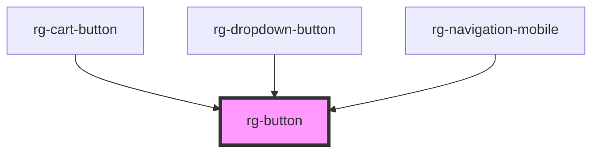

# rg-button

<!-- Auto Generated Below -->

## Properties

| Property | Attribute | Description | Type     | Default     |
| -------- | --------- | ----------- | -------- | ----------- |
| `href`   | `href`    |             | `string` | `undefined` |
| `icon`   | `icon`    |             | `string` | `undefined` |

## Dependencies

### Used by

 - [rg-cart-button](../cart-button)
 - [rg-dropdown-button](../dropdown-button)
 - [rg-navigation-mobile](../navigation-mobile)

### Graph

----------------------------------------------

*Built with [StencilJS](https://stenciljs.com/)*
