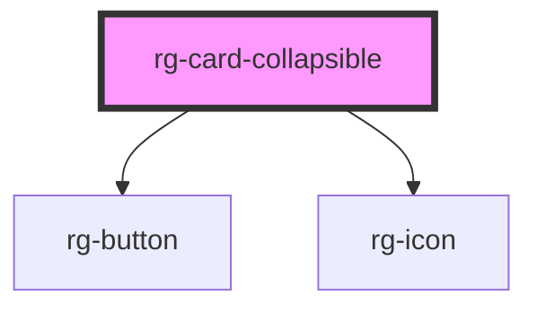

# rg-card-collapsible

<!-- Auto Generated Below -->

## Properties

| Property        | Attribute        | Description | Type     | Default     |
| --------------- | ---------------- | ----------- | -------- | ----------- |
| `contentHeight` | `content-height` |             | `number` | `undefined` |
| `readLessText`  | `read-less-text` |             | `string` | `undefined` |
| `readMoreText`  | `read-more-text` |             | `string` | `undefined` |

## Dependencies

### Depends on

- [rg-button](../button)
- [rg-icon](../icon)

### Graph

----------------------------------------------

*Built with [StencilJS](https://stenciljs.com/)*
