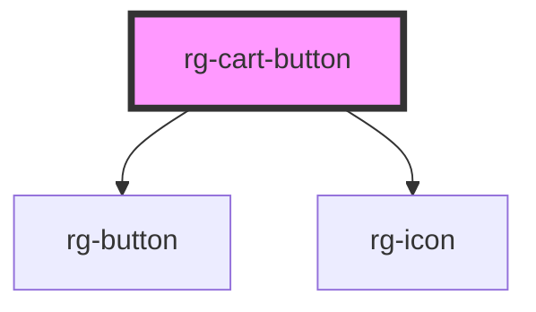

# rg-cart-button

<!-- Auto Generated Below -->

## Properties

| Property       | Attribute       | Description | Type     | Default     |
| -------------- | --------------- | ----------- | -------- | ----------- |
| `cartQuantity` | `cart-quantity` |             | `number` | `undefined` |
| `href`         | `href`          |             | `string` | `undefined` |

## Dependencies

### Depends on

- [rg-button](../button)
- [rg-icon](../icon)

### Graph

----------------------------------------------

*Built with [StencilJS](https://stenciljs.com/)*
