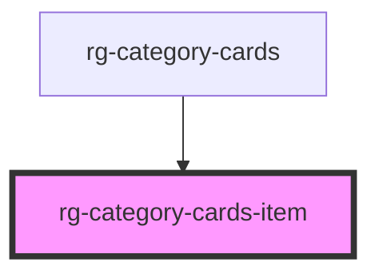

# rg-category-cards-item

<!-- Auto Generated Below -->

## Properties

| Property | Attribute | Description | Type     | Default     |
| -------- | --------- | ----------- | -------- | ----------- |
| `img`    | `img`     |             | `string` | `undefined` |
| `link`   | `link`    |             | `string` | `undefined` |
| `name`   | `name`    |             | `string` | `undefined` |

## Dependencies

### Used by

 - [rg-category-cards](../category-cards)

### Graph

----------------------------------------------

*Built with [StencilJS](https://stenciljs.com/)*
