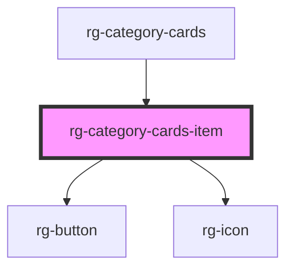

# rg-category-cards-item

<!-- Auto Generated Below -->

## Properties

| Property     | Attribute     | Description | Type     | Default     |
| ------------ | ------------- | ----------- | -------- | ----------- |
| `buttonName` | `button-name` |             | `string` | `undefined` |
| `img`        | `img`         |             | `string` | `undefined` |
| `link`       | `link`        |             | `string` | `undefined` |
| `name`       | `name`        |             | `string` | `undefined` |

## Dependencies

### Used by

 - [rg-category-cards](../category-cards)

### Depends on

- [rg-button](../button)
- [rg-icon](../icon)

### Graph

----------------------------------------------

*Built with [StencilJS](https://stenciljs.com/)*
