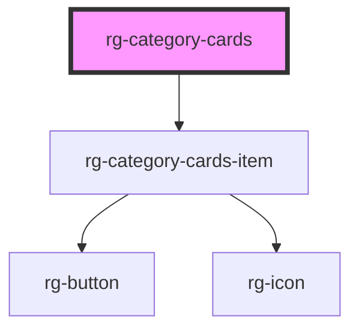

# rg-category-cards

<!-- Auto Generated Below -->

## Properties

| Property            | Attribute             | Description | Type     | Default     |
| ------------------- | --------------------- | ----------- | -------- | ----------- |
| `buttonName`        | `button-name`         |             | `string` | `undefined` |
| `categoryCardsData` | `category-cards-data` |             | `any`    | `[]`        |

## Dependencies

### Depends on

- [rg-category-cards-item](../category-cards-item)

### Graph

----------------------------------------------

*Built with [StencilJS](https://stenciljs.com/)*
