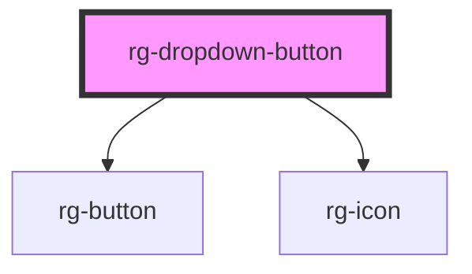

# rg-dropdown-button

<!-- Auto Generated Below -->

## Properties

| Property        | Attribute        | Description                              | Type     | Default     |
| --------------- | ---------------- | ---------------------------------------- | -------- | ----------- |
| `totalElements` | `total-elements` | Helps to render required amount of slots | `number` | `undefined` |

## Dependencies

### Depends on

- [rg-button](../button)
- [rg-icon](../icon)

### Graph

----------------------------------------------

*Built with [StencilJS](https://stenciljs.com/)*
