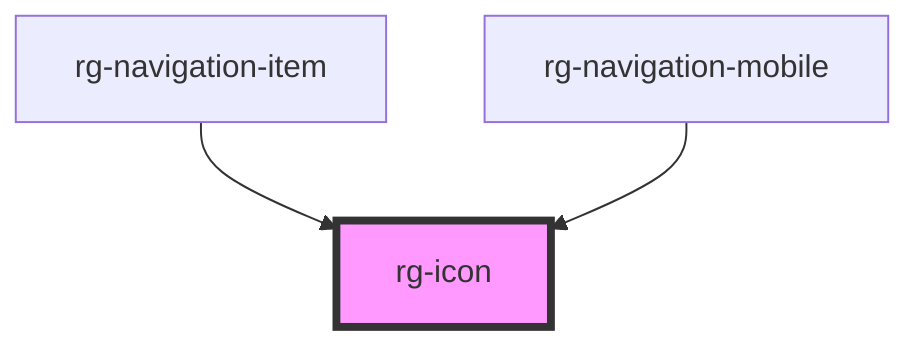

# rg-icon

<!-- Auto Generated Below -->

## Properties

| Property | Attribute | Description | Type                                | Default     |
| -------- | --------- | ----------- | ----------------------------------- | ----------- |
| `size`   | `size`    |             | `IconSize.MEDIUM \| IconSize.SMALL` | `undefined` |
| `type`   | `type`    |             | `string`                            | `undefined` |

## Dependencies

### Used by

 - [rg-navigation-item](../navigation-item)
 - [rg-navigation-mobile](../navigation-mobile)

### Graph

----------------------------------------------

*Built with [StencilJS](https://stenciljs.com/)*
