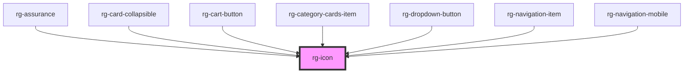

# rg-icon

<!-- Auto Generated Below -->

## Properties

| Property | Attribute | Description | Type                                   | Default     |
| -------- | --------- | ----------- | -------------------------------------- | ----------- |
| `color`  | `color`   |             | `IconColor.PRIMARY \| IconColor.WHITE` | `undefined` |
| `size`   | `size`    |             | `IconSize.MEDIUM \| IconSize.SMALL`    | `undefined` |
| `type`   | `type`    |             | `string`                               | `undefined` |

## Dependencies

### Used by

 - [rg-assurance](../assurance)
 - [rg-card-collapsible](../card-collapsible)
 - [rg-cart-button](../cart-button)
 - [rg-category-cards-item](../category-cards-item)
 - [rg-dropdown-button](../dropdown-button)
 - [rg-navigation-item](../navigation-item)
 - [rg-navigation-mobile](../navigation-mobile)

### Graph

----------------------------------------------

*Built with [StencilJS](https://stenciljs.com/)*
