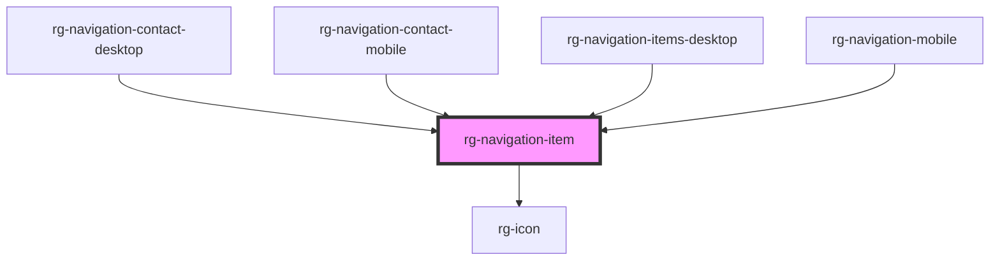

# rg-navigation-item

<!-- Auto Generated Below -->

## Properties

| Property | Attribute | Description | Type                                | Default     |
| -------- | --------- | ----------- | ----------------------------------- | ----------- |
| `active` | `active`  |             | `boolean`                           | `false`     |
| `icon`   | `icon`    |             | `string`                            | `undefined` |
| `link`   | `link`    |             | `string`                            | `undefined` |
| `size`   | `size`    |             | `IconSize.MEDIUM \| IconSize.SMALL` | `undefined` |

## Dependencies

### Used by

 - [rg-navigation-contact-desktop](../navigation-contact-desktop)
 - [rg-navigation-contact-mobile](../navigation-contact-mobile)
 - [rg-navigation-items-desktop](../navigation-items-desktop)
 - [rg-navigation-mobile](../navigation-mobile)

### Depends on

- [rg-icon](../icon)

### Graph

----------------------------------------------

*Built with [StencilJS](https://stenciljs.com/)*
