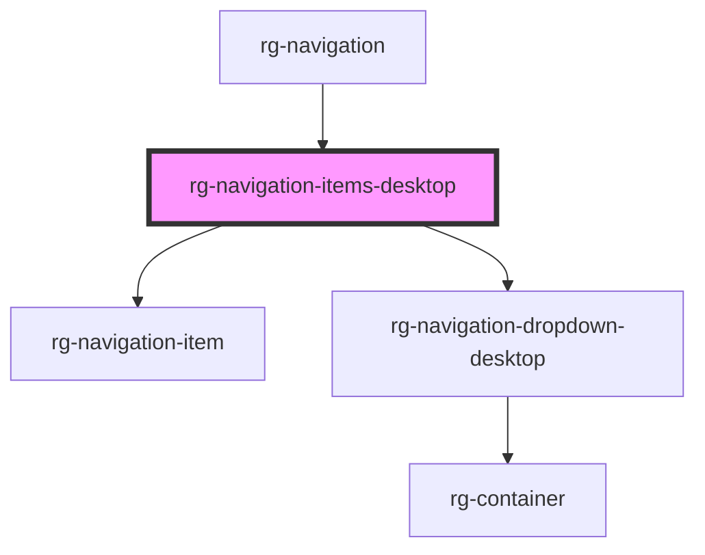

# rg-navigation-items-desktop

<!-- Auto Generated Below -->

## Properties

| Property           | Attribute           | Description | Type  | Default |
| ------------------ | ------------------- | ----------- | ----- | ------- |
| `navigationFields` | `navigation-fields` |             | `any` | `[]`    |

## Dependencies

### Used by

 - [rg-navigation](../navigation)

### Depends on

- [rg-navigation-item](../navigation-item)
- [rg-navigation-dropdown-desktop](../navigation-dropdown-desktop)

### Graph

----------------------------------------------

*Built with [StencilJS](https://stenciljs.com/)*
