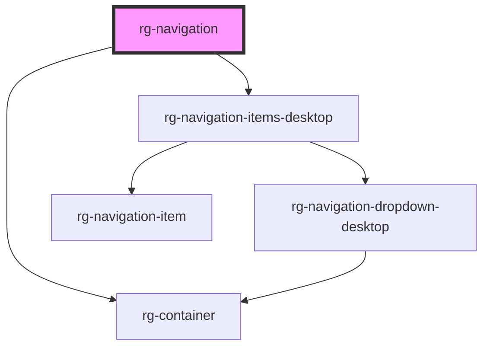

# rg-navigation

<!-- Auto Generated Below -->

## Properties

| Property           | Attribute           | Description                                                      | Type     | Default     |
| ------------------ | ------------------- | ---------------------------------------------------------------- | -------- | ----------- |
| `logoPath`         | `logo-path`         |                                                                  | `string` | `undefined` |
| `logoTitle`        | `logo-title`        |                                                                  | `string` | `undefined` |
| `navigationFields` | `navigation-fields` | A property which holds serialized data of Array<NavigationField> | `string` | `undefined` |

## Dependencies

### Depends on

- [rg-container](../container)
- [rg-navigation-items-desktop](../navigation-items-desktop)

### Graph

----------------------------------------------

*Built with [StencilJS](https://stenciljs.com/)*
