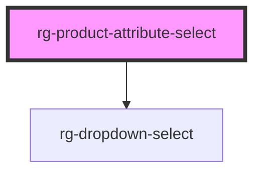

# rg-product-attribute-select

<!-- Auto Generated Below -->

## Properties

| Property               | Attribute                | Description | Type                               | Default     |
| ---------------------- | ------------------------ | ----------- | ---------------------------------- | ----------- |
| `attributeName`        | `attribute-name`         |             | `string`                           | `undefined` |
| `productAttribute`     | `product-attribute`      |             | `string`                           | `undefined` |
| `productAttributeData` | `product-attribute-data` |             | `ProductAttributeData[] \| string` | `[]`        |

## Dependencies

### Depends on

- [rg-dropdown-select](../dropdown-select)

### Graph

----------------------------------------------

*Built with [StencilJS](https://stenciljs.com/)*
